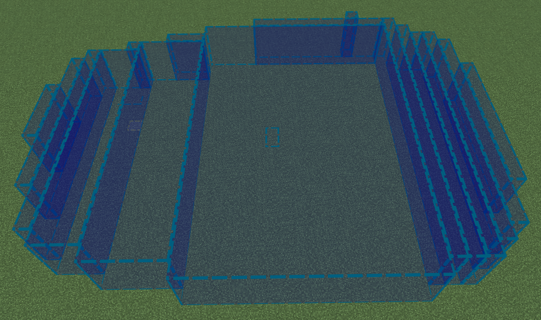
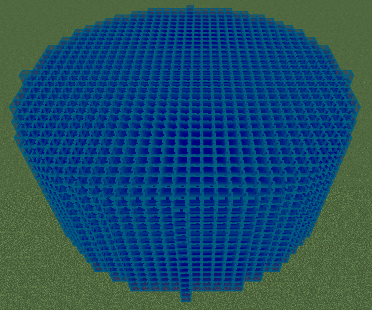
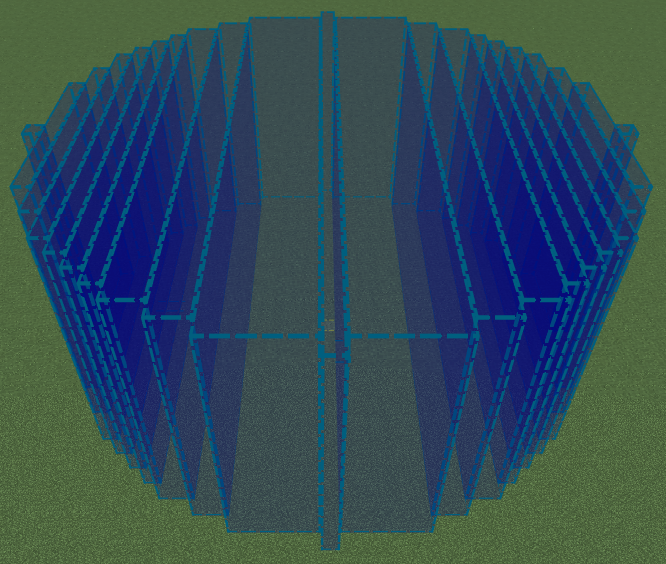
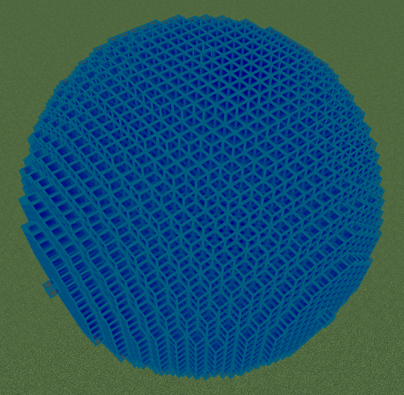
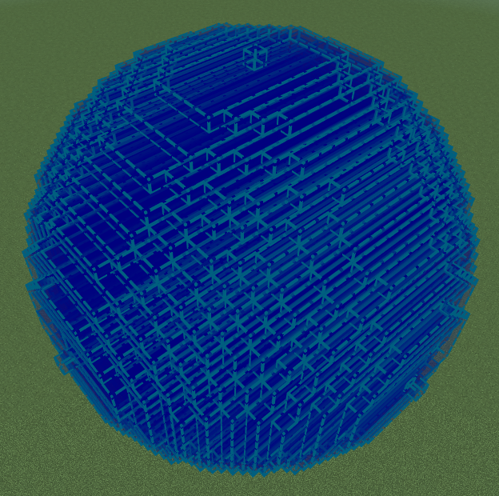

# editor-mesh
A typescript implementation of greedy meshing to optimize custom tools in the Minecraft Editor.

## Getting started
The latest `mesh.js` file can be downloaded from the [releases](https://github.com/TwistedAsylumMC/editor-mesh/releases) page.

Creating a mesh is extremely simple. You first create a new Mesh object and use the `add(Vector3)` method to add a single block. Once all your blocks are added, you can use the `calculateVolumes(): BlockVolume[]` method to get all the volumes from the mesh and add them to your selection.
```js
import { Mesh } from "./mesh";

// Create the mesh and set some blocks
const mesh = new Mesh();
for (let x = 0; x < 5; x++) {
    for (let y = 0; y < 5; y++) {
        for (let z = 0; z < 5; z++) {
            mesh.add({x, y, z});
        }
    }
}

// Create a new selection, push all the volumes and replace the existing selection
const currentSelection = uiSession.extensionContext.previewSelection;
const newSelection = uiSession.extensionContext.selectionManager.createSelection();
for (const blockVolume of mesh.calculateVolumes()) {
    newSelection.pushVolume(Editor.SelectionBlockVolumeAction.add, blockVolume);
}
currentSelection.copyFrom(newSelection);
```

## Including previous selections


If your tool allows for dragging, you may want to include all the existing volumes that have already been added to help with performance and prevent overlapping. This can be achieved by using the `getBlockPositionIterator(): Iterable<Vector3>` method on the current selection and adding each block to the mesh.
```js=
for (const pos of currentSelection.getBlockPositionIterator()) {
    mesh.add(pos);
}=
```

# What does it actually do?
The greedy meshing algorithm turns an array of voxels in to the smallest number of volumes possible to cover the entire area. If you are interested in learning more about greedy meshing, take a look at the section below.

The meshes shown below were generated using [DarkGamerYT's Bedrock Editor Extension](https://github.com/DarkGamerYT/Bedrock-Editor-Extension).

|                      **Without Meshing**                      |                           **With Meshing**                           |
|:-------------------------------------------------------------:|:--------------------------------------------------------------------:|
|  |  |
|                         12752 Volumes                         |                              21 Volumes                              |
|    |    |
|                         17077 Volumes                         |                              358 Volumes                             |

## Useful resources
- https://0fps.net/2012/06/30/meshing-in-a-minecraft-game/
- https://devforum.roblox.com/t/consume-everything-how-greedy-meshing-works/452717
- https://www.youtube.com/watch?v=L6P86i5O9iU